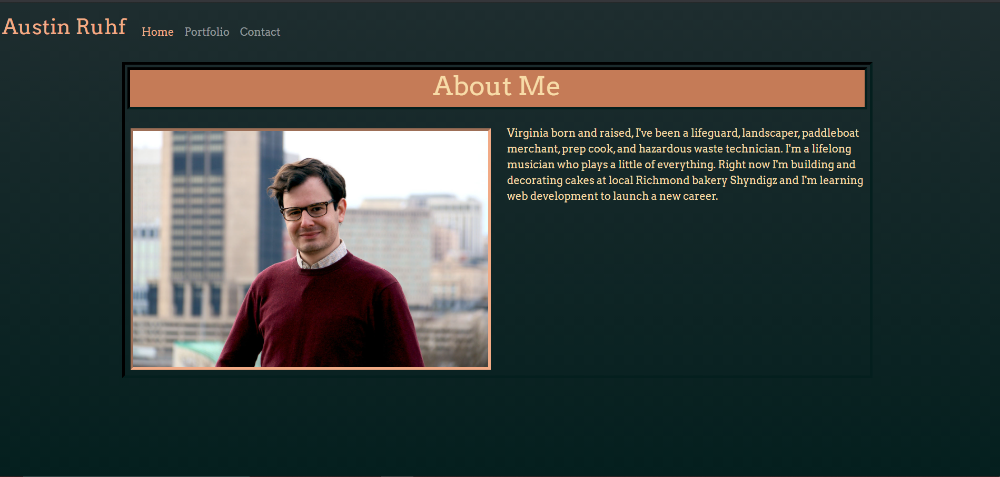

# Homework_02-Responsive_Portfolio

## Project Description
*UPDATE* Now Featuring an updated contacts page with links to GitHub, Linkedin, and a downloadable pdf of my resume!
This assignment was all about using Bootstrap and CSS to design a portfolio website to display our work as web developers. Crucially, the website had to account for different screen sizes and be perfectly functional on both computer and mobile. I chose to start with a 5-color pallette and frame a minimal, sleek border-in-border design over a subtle gradient.

### Application Link
Deployed Link: [https://acruhf.github.io/Responsive_Portfolio/]

### Screenshot of Deployed Page

### Credits
Collaborated with Amanda Wiehrs
